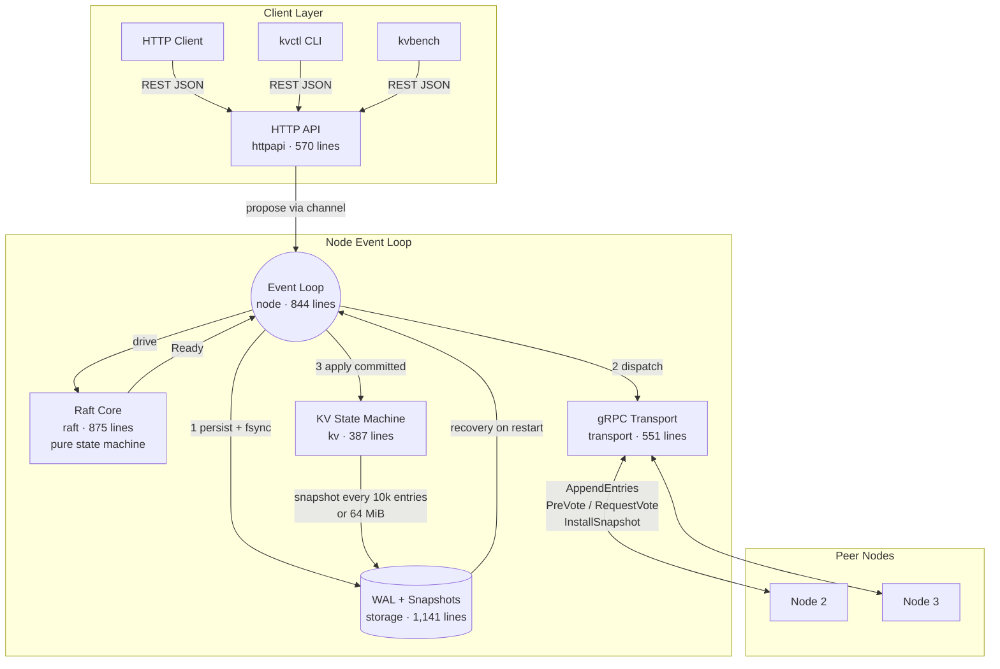

# raft-kv

**A distributed key-value store built on a Raft consensus implementation written from scratch in Go.**

No consensus library is wrapped. The Raft algorithm -- leader election, log replication, PreVote protocol, check-quorum protocol, snapshot transfer, and log compaction -- is implemented as a deterministic state machine in ~1,300 lines of Go, verified by simulation, crash injection, and linearizability checking across millions of operations.

> **Maturity.** This is a portfolio and learning project. It has been tested hard and has never run in production. Membership is fixed, data lives in memory with a 64 MiB limit, and no external review has been conducted. Do not store data you care about in it.

---

## Table of Contents

- [Architecture](#architecture)
- [Design Patterns](#design-patterns)
- [Technology Stack](#technology-stack)
- [Core Workflows](#core-workflows)
- [Reliability and Distributed Systems](#reliability-and-distributed-systems)
- [Security Model](#security-model)
- [Project Structure](#project-structure)
- [Setup and Usage](#setup-and-usage)
- [Measured Engineering Metrics](#measured-engineering-metrics)
- [Engineering Trade-offs and Limitations](#engineering-trade-offs-and-limitations)
- [Documentation](#documentation)
- [References and Attribution](#references-and-attribution)

---

## Architecture

The system is structured around a **single event loop per node** that owns all consensus state, eliminating shared-state concurrency from the critical path. The Raft core is a pure state machine: it performs no I/O, spawns no goroutines, and holds no reference to the clock. A caller drives it with `Tick()`, `Step()`, and `Propose()`, then reads `Ready()` to learn what must be persisted, sent, and applied.



### Goroutine Ownership Model

| Goroutine | Started By | Owns | Lifetime |
|---|---|---|---|
| Event loop | `node.Start` | Raft core, WAL writer, KV store, client waiters | Until `Stop()` or storage failure |
| Snapshot writer | Event loop (at most one) | One temporary snapshot file | Until written and published |
| Peer sender (one per peer) | `transport.New` | That peer's bounded outbound queue | Until `transport.Close` |
| Snapshot sender (one per peer) | Peer sender | One open snapshot file + gRPC stream | Until transfer ends |
| gRPC handlers | gRPC server | Nothing shared | Per-RPC |
| HTTP handlers | `net/http` | Nothing shared | Per-request |

Dependencies flow one way: `raft` imports nothing from this repository; `storage` and `kv` know `raft`'s types and nothing else; `node` connects all three; `transport` and `httpapi` define small consumer-side interfaces that `*node.Node` satisfies. Neither imports the other.

---

## Design Patterns

### Deterministic State Machine (Raft Core)

The Raft core (`internal/raft`) exposes five methods and performs zero side effects:

```go
func (r *Raft) Tick()                    // one unit of logical time
func (r *Raft) Step(m Message)           // a message arrived
func (r *Raft) Propose(data []byte)      // client wants this replicated
func (r *Raft) Ready() Ready             // what must now be done
func (r *Raft) Advance()                 // caller did it
```

`Ready` is a struct of side effects: hard state to persist, messages to send, entries to apply. The core never executes them. This buys two things: (1) the entire cluster can be simulated in one goroutine with a fake clock, network, and disk, all driven by a seeded RNG, making failures deterministically replayable; (2) ordering rules (persist before send, send before apply) live in one place and both callers -- the real node and the simulator -- follow the same contract.

The random number generator is injected (`rand.Rand`), never `math/rand` global state. The election timeout is randomised per term using this injected source.

### Append-Only Write-Ahead Log

The WAL never truncates. A follower replacing a conflicting log suffix appends the replacement; on replay, an entry whose index is not past the end of the log replaces everything from that index onward. This eliminates intermediate states during suffix replacement: one appended write, not a truncate-then-write that a crash could split.

Each record carries a 13-byte header: 1 byte type, 4 bytes payload length (LE), 4 bytes CRC-32C of payload, 4 bytes CRC-32C of the header prefix. The header checksum prevents a bit-flip in the length field from being misinterpreted as a torn tail (which would silently drop the remainder of the segment).

### Ready-Based Output Pattern

Inspired by etcd/raft's `Ready` interface. The event loop calls `Ready()`, persists what it says, sends what it says, applies what it says, then calls `Advance()`. No callback registration, no observer pattern, no event bus.

### Consumer-Defined Interfaces

Go interfaces are declared by the consumer, not the implementer. `transport.Handler` describes what the transport needs from a node; `httpapi.Node` describes what the API needs. `*node.Node` satisfies both without knowing about either package.

### Client Sessions for Retry De-duplication

Client identity (`X-Client-Id`, `X-Request-Seq`) is replicated in the Raft log. The KV state machine stores the latest result per client in a bounded LRU (4,096 entries). Sessions survive snapshots, failover, and full cluster restarts.

### Bounded Everything

Every channel, queue, and buffer has a fixed bound. The proposal channel is bounded; exceeding it returns `429 OVERLOADED` immediately. Per-peer send queues are bounded; overflow drops the message (Raft retries). Snapshot transfers are streamed in bounded chunks. The HTTP body reader is capped at 1 MiB.

---

## Technology Stack

| Component | Technology | Version | Purpose |
|---|---|---|---|
| Language | Go | 1.27.1 | All application code |
| Consensus | Custom Raft | -- | Elections, replication, PreVote, check-quorum, snapshots |
| Peer Protocol | gRPC | v1.84.0 | Inter-node communication (4 RPCs) |
| Serialisation | Protocol Buffers | v1.36.12 | Peer message encoding |
| Client API | `net/http` (stdlib) | -- | REST/JSON, no framework |
| Metrics | Prometheus client_golang | v1.24.1 | 15 instrumented metrics |
| Linearizability | Porcupine | v1.3.1 | History checking (test-only) |
| Leak Detection | goleak | v1.3.0 | Goroutine leak checks (test-only) |
| TLS | `crypto/tls` (stdlib) | -- | Mutual TLS 1.3 (peers), TLS 1.2+ (clients) |
| Containers | Docker multi-stage | Alpine 3.23 | Pinned by digest, UID 10001 |
| Orchestration | Docker Compose v2 | -- | 3-node, 5-node, secure, chaos overlays |
| CI | GitHub Actions | -- | 5 jobs, actions pinned to commit SHA |
| Vulnerability Scan | govulncheck | v1.8.0 | With documented exceptions |

**Direct dependencies** (5): `grpc`, `protobuf`, `prometheus/client_golang`, `porcupine` (test), `goleak` (test).

---

## Core Workflows

### Write Path

```
Client ──HTTP PUT──► httpapi ──channel──► Event Loop
                                              │
                                    Raft.Propose(encoded command)
                                              │
                                    Raft appends to in-memory log
                                              │
                                    Ready() returns:
                                      • HardState to persist
                                      • Entries to persist
                                      • Messages to send
                                              │
                              ┌────────────────┼────────────────┐
                              ▼                                 │
                    1. WAL.Save() + fsync                       │
                              │                                 │
                              ▼                                 │
                    2. Transport.Send(AppendEntries)             │
                              │                                 │
                              ▼                                 │
                    Followers: WAL.Save() + fsync, then ACK      │
                              │                                 │
                              ▼                                 │
                    Majority ACKs ──► commit index advances      │
                              │                                 │
                              ▼                                 │
                    3. kv.Store.Apply(command) ──► result to client
```

The leader's own entry counts toward the quorum only after `Advance()`, which runs after the WAL fsync. Two fsyncs in series per write (leader + at least one follower on the same disk in the test setup).

### Read Path

Reads take the same path as writes: the `GET` handler creates a read command, proposes it through Raft, and the result is returned only after the entry commits. A leader that has been partitioned away cannot get a majority to accept the entry, so it cannot answer. This is the full linearisability argument, with no clock dependency.

### Failover

1. Followers detect a missing heartbeat after `ElectionTimeout` ticks (randomised per term, default 10-20 ticks at 100ms each).
2. A follower sends `PreVote` requests. If a majority would vote, it starts a real election. PreVote prevents a partitioned node from incrementing the cluster's term on return.
3. `CheckQuorum`: a leader that has not heard from a majority within the election timeout steps down. This prevents a partitioned leader from serving stale reads.
4. Measured failover: 0.8 to 1.1 s with default timing in Docker demos; 1.4 to 1.9 s under benchmark load with no failed client requests.

### Snapshot Lifecycle

1. **Trigger**: every 10,000 applied entries, or when `bytesSince` exceeds `SnapshotBytes` (default 64 MiB).
2. **Create**: write to a temporary file, fsync, atomic rename, fsync the directory, then delete covered log segments.
3. **Transfer**: the leader streams the snapshot to a lagging follower in bounded chunks via client-side gRPC streaming. The follower writes, verifies the SHA-256 digest, and installs atomically.
4. **Recovery**: on restart, the snapshot is loaded first, then the WAL is replayed from the snapshot's last included index.

---

## Reliability and Distributed Systems

### Guarantees

| Property | Mechanism | Evidence |
|---|---|---|
| **Linearisability** | All operations (reads included) go through the replicated log | Porcupine checked 2,046,005 operations across 3,000 seeds under partitions and crashes |
| **Durability** | WAL fsync before every acknowledgement; majority replication | Crash injection at 84,524 filesystem operations; all-nodes-killed integration test |
| **At-most-once semantics** | Client sessions `(clientID, seq)` in replicated state | Retry-after-failover tests; retry-after-full-restart integration test |
| **No stale reads** | A partitioned leader cannot commit a read entry | Simulator invariant; `demo-partition.sh`; `TestIsolatedLeaderCannotAcknowledgeReadsOrWrites` |
| **Honest timeouts** | `504 TIMEOUT` with `"outcome": "unknown"` | `TestDeadline`; partition demo |

### Failure Model

Crashes, restarts, lost/delayed/duplicated/reordered messages, and network partitions. Members are trusted (not Byzantine). The system tolerates `f` failures in a cluster of `2f + 1` nodes.

### Testing Layers

| Layer | What It Checks | Scale |
|---|---|---|
| **Deterministic simulation** | Full Raft cluster in one goroutine; seeded RNG; invariants after every tick: single leader per term, no committed entry lost, all nodes apply the same sequence | 1,500 seeds across 14 scenario variants |
| **Crash injection** | Fault-modelling filesystem (`faultfs`) that forgets un-fsynced data; crashes at every filesystem operation | 400 workloads, 84,524 crash points |
| **Linearizability checking** | Concurrent client histories checked against a nondeterministic sequential model; unknown-outcome operations modelled correctly | 3,000 seeds, 2,046,005 operations, 16,824 unknown outcomes |
| **Linearizability - live** | Same checking against a real in-process cluster under a nemesis (partitions, crashes, link failures) | ~117,000 operations per run |
| **Integration tests** | Real `kvserver` processes: SIGKILL, restart, snapshot catch-up, corrupt log, wrong cluster data, secure mode | 11 tests |
| **Docker fault demos** | Scripted failures with self-checking assertions: leader kill, network partition, link failure, quorum loss, snapshot, five-node | 6 demos |
| **Fuzz testing** | Command decoder, snapshot decoder, WAL recovery | 5 targets |
| **Race detection** | All unit tests under `-race` | Every CI run |
| **Goroutine leak checks** | `goleak` in `node` and `transport` packages | Every test run |

**Bugs found during development**: 10, each with a regression test. Highlights: a message amplification loop (every ACK triggered another send), three WAL recovery errors at specific crash points, a 26-second outage from gRPC DNS resolver caching. Full list in [docs/testing-and-failures.md](docs/testing-and-failures.md#bugs-found-during-development).

---

## Security Model

### Peer Authentication (Mutual TLS 1.3)

Every node holds a certificate signed by the cluster's CA. The common name must match the node ID. A node:
- Accepts peer connections only from certificates chaining to the cluster CA (`RequireAndVerifyClientCert`).
- Verifies the sender in every Raft message matches the certificate identity.
- When dialling, additionally requires the server's certificate to carry the intended peer's ID.

Wrong CA, wrong identity, impersonation, and plaintext connections are all rejected (tested in `internal/security` and `internal/transport`).

### Client Authentication (Bearer Token)

In secure mode, `/v1/` requests require a bearer token loaded from a file at startup. Token comparison uses `crypto/subtle.ConstantTimeCompare` to prevent timing side-channels. Minimum token length: 24 characters.

### Container Security

- **Unprivileged user**: UID 10001 (`raftkv`), no root in the runtime image.
- **Read-only root filesystem** compatible (data volume is the only writable mount).
- **No shell, no package manager cache** in the runtime image.
- **Base images pinned by digest** to prevent supply-chain drift.
- **Chaos target** (iptables for fault demos) is a separate build stage; the runtime image has no extra capabilities.

### Operational Security Practices

- Bearer tokens are loaded from files, never from flags or environment variables visible in process listings.
- Log lines carry operation metadata but never key values, tokens, or credentials.
- Metrics labels use fixed sets (operation name, outcome, peer ID); keys, values, and client IDs never become labels (prevents cardinality explosion).
- The server refuses to start unless the operator explicitly chooses `--insecure` or provides TLS configuration.

---

## Project Structure

```
├── cmd/
│   ├── kvserver/           Server binary (main, config wiring, signal handling)
│   ├── kvctl/              CLI client (status, get, put, cas, delete)
│   └── kvbench/            Closed-loop load generator with JSON reports
├── internal/
│   ├── raft/               Consensus algorithm (875 + 307 + 144 = 1,326 lines)
│   │   ├── raft.go         Elections, replication, commit rule, PreVote, check-quorum
│   │   ├── types.go        Messages, Ready contract, Role enum
│   │   └── log.go          In-memory log with compaction
│   ├── storage/            Durable state (625 + 516 = 1,141 lines)
│   │   ├── wal.go          Write-ahead log: record format, replay, torn-tail detection
│   │   ├── store.go        WAL + snapshot coordination, recovery, compaction
│   │   ├── snapshot.go     Snapshot file format, SHA-256 verification
│   │   ├── fs.go           Filesystem abstraction (real + injectable for tests)
│   │   └── lock_unix.go    flock-based single-instance guard
│   ├── kv/                 State machine (387 lines)
│   │   ├── store.go        Apply, CAS, client session LRU, snapshot encode/decode
│   │   └── command.go      Command encoding (PUT, GET, DELETE, CAS, NOOP, READ)
│   ├── node/               Event loop (844 lines)
│   │   └── node.go         processReady, tick driving, proposal routing, snapshot trigger
│   ├── transport/          Peer communication (551 lines)
│   │   ├── transport.go    gRPC client/server, per-peer sender, snapshot streaming
│   │   └── convert.go      Proto ↔ domain type conversion
│   ├── httpapi/            Client API (570 lines)
│   │   └── httpapi.go      REST handlers, error codes, outcome tracking, auth
│   ├── client/             Go HTTP client (leader hints, retries, identity tracking)
│   ├── config/             Configuration (flags, env, JSON file, validation) (464 lines)
│   ├── security/           TLS config builders, token loading (103 lines)
│   ├── observability/      Prometheus metrics, structured logger (266 lines)
│   └── testutil/
│       ├── sim/            Deterministic cluster simulator + invariant checker
│       ├── faultfs/        Crash-modelling in-memory filesystem
│       ├── memnet/         In-memory network for simulation
│       └── testcluster/    In-process cluster harness for unit tests
├── tests/
│   ├── linearizability/    Porcupine model, sim-based and live history checks
│   └── integration/        Real-process tests (build tag: integration)
├── api/raft/v1/            Protobuf service definition (4 RPCs)
├── scripts/                15 shell scripts (demos, benchmarks, cert gen, cluster ops)
├── docs/                   10 documents + 5 ADRs
├── benchmarks/             Experiment records and raw JSON results
├── .github/workflows/      CI (5 jobs) and nightly (wide sweeps + fuzzing)
├── Dockerfile              Multi-stage: build → runtime → chaos
├── docker-compose.yml      3-node dev cluster
├── docker-compose.5node.yml
├── docker-compose.secure.yml
├── docker-compose.chaos.yml
└── Makefile                28 targets
```

---

## Setup and Usage

### Prerequisites

Go 1.27+, Docker with Compose v2, `make`, `curl`, `jq`. On Windows, run everything inside WSL2.

### Build and Run

```sh
git clone https://github.com/bhattt1/RaftBasedDistributedKey.git
cd RaftBasedDistributedKey
make build                        # produces bin/kvserver, bin/kvctl, bin/kvbench
docker compose up -d --build      # 3-node cluster on 127.0.0.1:8001-8003
bin/kvctl status
```

```
ENDPOINT                     NODE   ROLE       TERM   LEADER     COMMIT  APPLIED SNAPSHOT   KEYS
http://127.0.0.1:8001        n1     follower   1      n2              1        1        0      0
http://127.0.0.1:8002        n2     leader     1      n2              1        1        0      0
http://127.0.0.1:8003        n3     follower   1      n2              1        1        0      0
```

### Key-Value Operations

```sh
bin/kvctl put greeting hello                       # OK revision=2
bin/kvctl get greeting                             # hello
bin/kvctl cas greeting hi --expect-value hello     # OK swapped revision=4
bin/kvctl cas greeting oops --expect-value hello   # NOT SWAPPED ... (exit code 4)
bin/kvctl delete greeting                          # OK deleted
bin/kvctl get greeting                             # (not found)   (exit code 3)
```

The same over HTTP:

```sh
curl -s -X PUT localhost:8001/v1/kv/greeting -d '{"value":"hello"}'
curl -s localhost:8001/v1/kv/greeting
curl -s -X POST localhost:8001/v1/kv/greeting/cas \
     -d '{"value":"hi","expect_value":"hello"}'
```

Non-leader nodes respond with `421 NOT_LEADER` and the leader's address. Full API reference: [docs/api.md](docs/api.md).

### Secure Mode (mTLS + HTTPS + Bearer Token)

```sh
scripts/gen-dev-certs.sh                      # generate dev certificates
scripts/cluster.sh secure-up                  # start with TLS
bin/kvctl --ca-cert certs/ca.pem \
          --token-file certs/client.token \
          --endpoints https://127.0.0.1:8201,https://127.0.0.1:8202,https://127.0.0.1:8203 \
          status
```

### Fault Demonstrations

```sh
make demo                                     # all six scripted failures
```

| Demo | What Happens |
|---|---|
| **Kill the leader** (`SIGKILL`) | New leader in 0.8-1.1 s. All acknowledged writes present after rejoin. |
| **Isolate the leader** (iptables) | Isolated leader returns `504`; majority elects new leader; after healing all writes present. |
| **Break one link** (12 s) | No election (PreVote working). Same leader, same term. |
| **Stop two of three** | Survivor acknowledges nothing. Service resumes on return. |
| **Snapshot catch-up** | Follower ~3,000 entries behind installs snapshot, matches leader. |
| **Five-node tolerance** | Tolerates 2 failures; refuses with 3 down; recovers in 1-2 s. |

### Testing

```sh
make test              # unit tests + simulations (~15 s)
make test-race         # with race detector (~25 s)
make sim               # Raft simulation, 300 seeds
make crash             # crash at every filesystem operation
make linearizability   # Porcupine history checking
make integration       # real server processes
make chaos             # Docker fault demos
make fuzz              # command, snapshot, WAL decoders
make check             # everything CI runs
```

### Benchmarks

```sh
scripts/bench.sh       # full matrix: topologies × workloads × concurrency
make bench-micro       # WAL fsync, state machine, codec micro-benchmarks
```

---

## Measured Engineering Metrics

Every number below is derived from the codebase or from recorded benchmark runs. Nothing is estimated or projected.

### Codebase

| Metric | Value | Source |
|---|---|---|
| Non-test Go | 10,007 lines | `find cmd internal tests -name '*.go' ! -name '*_test.go' ! -path '*/gen/*' \| xargs wc -l` |
| Test Go | 8,589 lines | `find cmd internal tests -name '*_test.go' \| xargs wc -l` |
| Test ratio | 0.86 lines of test per line of production code | |
| Test functions | 205 | `grep -rhE '^func Test' --include='*_test.go'` |
| Fuzz targets | 5 | Command decoder, Apply, Restore, WAL recovery, snapshot decoding |
| Go benchmarks | 8 | WAL, state machine, codec |
| Direct dependencies | 5 | `go.mod` require block |
| Prometheus metrics | 15 | `internal/observability/metrics.go` |
| HTTP error codes | 16 | `internal/httpapi/httpapi.go` const block |
| gRPC RPCs | 4 | PreVote, RequestVote, AppendEntries, InstallSnapshot |
| Makefile targets | 28 | `make help` |
| Shell scripts | 15 | `scripts/` |
| ADRs | 5 | `docs/adr/` |
| CI jobs | 5 | lint, test, integration, docker, vulnerabilities |
| Test coverage | 75.8% | `make cover` (unit + in-process; integration not instrumented) |

### Verification Scale

| Check | Scale | Source |
|---|---|---|
| Raft simulation seeds | 1,500 (widest run) | `make sim RAFT_SIM_SEEDS=1500` |
| Crash injection points | 84,524 across 400 workloads | `make crash STORAGE_CRASH_SEEDS=400` |
| Linearisability operations | 2,046,005 (3,000 seeds) | `make linearizability LIN_SIM_SEEDS=3000` |
| Unknown-outcome operations modelled | 16,824 | Same run |
| Live linearisability operations | ~117,000 per run under 26 faults | `TestLive` |
| Integration tests | 11 | `tests/integration/` |
| Bugs found by testing | 10 | [docs/testing-and-failures.md](docs/testing-and-failures.md) |

### Performance (Recorded)

All from `benchmarks/results/20261001T223620Z/`. One laptop (i5-1135G7, WSL2), all nodes on one disk, fsync on, 128-byte values, 16 closed-loop clients.

| Configuration | Throughput | p50 Latency | p99 Latency |
|---|---|---|---|
| 1-node write | 3,106 ops/s | 4.7 ms | 11.0 ms |
| 3-node write | 1,258 ops/s | 11.6 ms | 31.0 ms |
| 5-node write | 1,038 ops/s | 14.0 ms | 50.3 ms |
| 3-node read | 1,406 ops/s | 11.0 ms | 29.4 ms |
| 3-node write, 64 clients | 3,795 ops/s | 15.7 ms | -- |
| 3-node write, fsync off | 9,964 ops/s | -- | -- |
| Failover interruption | 1.4-1.9 s | -- | -- |

Reads cost what writes cost because they go through the log. The fsync-off mode loses acknowledged writes and exists only for comparison.

---

## Engineering Trade-offs and Limitations

| Decision | Alternative | Why This Way | Cost |
|---|---|---|---|
| Single event loop owns all consensus state | Mutex-protected shared state | No shared-state concurrency; enables deterministic simulation | The loop blocks during WAL fsync |
| Reads through the log | Leader reads its own map | A partitioned leader cannot answer; no clock dependency | A read costs as much as a write |
| Client sessions in replicated state | Retry cache in the HTTP layer | Survives failover, restart, and snapshot transfer | Clients must number requests |
| Append-only WAL, suffix replacement by appending | Truncate and rewrite | No intermediate crash state during suffix replacement | Wasted space until segment deletion |
| Persist, then send | Overlap leader fsync with replication | One ordering rule; [measured no gain on single-disk hardware](benchmarks/experiments/overlapped-replication.md) | Two sequential fsyncs per write |
| Fixed membership | Joint consensus or single-server changes | Eliminates a class of subtle bugs | A lost disk cannot be replaced in-place |
| In-memory data with 64 MiB cap | Disk-backed storage engine | Simplicity; consistent apply latency | Data size limit |
| Compile-time limits (key size, value size, state cap) | Per-node configuration | Limits affect command outcomes and must be identical across all nodes | Cannot tune per deployment |

### Known Limitations

- **No membership changes.** This is the largest operational gap.
- **No ReadIndex reads.** Every read pays the cost of a full log entry and fsync.
- **All data in memory.** 64 MiB of keys and values. Keys up to 256 bytes, values up to 64 KiB.
- **Linux only** for `kvserver`. `kvctl` and `kvbench` cross-compile to Windows and macOS.
- **Single-disk benchmarks.** All measurements are from nodes sharing one disk on one laptop.
- **No real power-loss testing.** Durability rests on the simulated filesystem and on fsync behaving as documented.
- **One open gRPC advisory** (GO-2026-6443): documented with reasoning in `.vuln-exceptions`.
- **CI not yet observed running on GitHub.** Workflows exist and every command passes locally.

---

## Documentation

| Document | Contents |
|---|---|
| [docs/architecture.md](docs/architecture.md) | Goroutine table, channel table, backpressure bounds, request flow, shutdown sequence |
| [docs/protocol.md](docs/protocol.md) | Every Raft rule with its test name |
| [docs/storage-and-recovery.md](docs/storage-and-recovery.md) | WAL record format, crash-safety argument, every crash window |
| [docs/api.md](docs/api.md) | HTTP API reference, error codes, request identity rules |
| [docs/operations.md](docs/operations.md) | Configuration, secure mode, metrics, troubleshooting, recovery boundaries |
| [docs/testing-and-failures.md](docs/testing-and-failures.md) | Test layers, commands, simulator, bugs found |
| [docs/benchmarks.md](docs/benchmarks.md) | Methodology, caveats, raw results |
| [docs/claims-and-evidence.md](docs/claims-and-evidence.md) | Every claim with implementation, check command, result, and limits |
| [docs/interview-guide.md](docs/interview-guide.md) | 60-second pitch, 5-minute walkthrough, 25 Q&A with code references |
| [docs/scope.md](docs/scope.md) | In/out scope, departures from brief, acceptance checklist |
| [docs/adr/](docs/adr/) | 5 architecture decision records |

### Reading the Code

Start here, in this order:

| File | What Is In It |
|---|---|
| [`internal/raft/types.go`](internal/raft/types.go) | Messages, the `Ready` contract |
| [`internal/raft/raft.go`](internal/raft/raft.go) | Elections, replication, commit rule |
| [`internal/raft/raft_test.go`](internal/raft/raft_test.go) | One test per Raft rule; read alongside the above |
| [`internal/node/node.go`](internal/node/node.go) | The event loop; `processReady` is the heart |
| [`internal/storage/wal.go`](internal/storage/wal.go) | Record format, replay, torn write vs. corruption |
| [`internal/kv/store.go`](internal/kv/store.go) | State machine, CAS, de-duplication |
| [`internal/httpapi/httpapi.go`](internal/httpapi/httpapi.go) | API handlers, how outcomes map to error codes |
| [`internal/testutil/sim/sim.go`](internal/testutil/sim/sim.go) | The simulator and its invariants |
| [`tests/linearizability/model.go`](tests/linearizability/model.go) | The sequential specification for Porcupine |

---

## References and Attribution

- Diego Ongaro and John Ousterhout, [In Search of an Understandable Consensus Algorithm](https://raft.github.io/raft.pdf) (extended version), and Ongaro's dissertation for PreVote, check-quorum, and the client-session design.
- [etcd's Raft library](https://github.com/etcd-io/raft), whose `Ready` interface inspired the output pattern here. No code was copied.
- [Porcupine](https://github.com/anishathalye/porcupine) by Anish Athalye for linearisability checking.
- [gRPC-Go](https://github.com/grpc/grpc-go), [protobuf-go](https://github.com/protocolbuffers/protobuf-go), [Prometheus client_golang](https://github.com/prometheus/client_golang), [goleak](https://github.com/uber-go/goleak).

Built with AI assistance (Claude); the commit history records it.

## Licence

[MIT](LICENSE).
