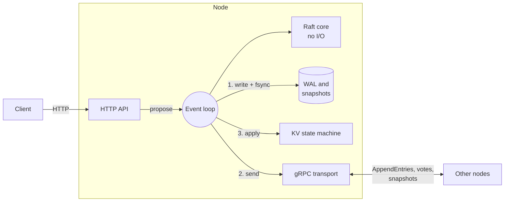

# raft-kv

A replicated key-value store in Go, built on a Raft implementation written
from scratch. Three or five nodes hold the same data; a write is acknowledged
only once a majority has it on disk, and a read can never return data that an
acknowledged write has already replaced.

**Maturity.** This is a learning and portfolio project. It is tested hard
(deterministic simulation, crash injection at every filesystem operation,
linearizability checking, real-process and Docker fault tests) and it has
never run in production. Membership is fixed, data lives in memory with a
64 MiB limit, and nobody outside its author has reviewed it. Do not put data
you care about in it.

## The problem

Keep a small amount of important data, such as "who currently holds this
lock", on several machines so that losing one loses nothing. Copying the
data is easy. Keeping the copies in agreement while machines crash and the
network drops messages is the hard part.

A concrete case. Three nodes, A leading. A client asks A to set `x = 1` and
gets "done". A crashes. If B takes over and `x = 1` was only ever on A, an
acknowledged write is gone. Or: the network cuts A off from B and C. B is
elected. A does not know. A client still connected to A reads `x` and gets a
value that B has since overwritten.

This project is about making both of those impossible, and then showing it:
the first by acknowledging only what a majority has stored durably, the
second by never answering anything, reads included, without a majority
taking part.

## What it does

- **Raft, implemented here**, not wrapped: leader election, log
  replication, PreVote, check-quorum, snapshots, log compaction.
  ([protocol](docs/protocol.md))
- **`PUT`, `GET`, `DELETE`** and atomic **compare-and-swap** on single keys.
- **Linearizable reads.** Every read goes through the replicated log.
- **Safe retries.** A retried write is recognised and not applied twice, on
  any node, across leader changes and restarts.
- **Honest timeouts.** A request that times out reports "outcome unknown".
- **Durable storage**: a checksummed write-ahead log with fsync before every
  acknowledgement, crash recovery, snapshots, catch-up of lagging followers.
  ([storage](docs/storage-and-recovery.md))
- **gRPC between nodes, HTTP for clients**, a CLI (`kvctl`), a load
  generator (`kvbench`).
- **Secure mode**: mutual TLS between nodes, HTTPS and a bearer token for
  clients. ([operations](docs/operations.md#security))
- **Metrics, structured logs, bounded queues, bounded shutdown.**

Supported: clusters of three or five nodes with a fixed member list, on
Linux (WSL2 on Windows).

Deliberately not included: adding or removing nodes, multi-key transactions,
range scans, watches, TTLs, sharding, ReadIndex or lease reads. See
[scope](docs/scope.md).

## Quick start

You need Go 1.27, Docker with Compose v2, `make`, and for the demos `curl`
and `jq`. On Windows, do all of this inside WSL2.

```sh
git clone https://github.com/bhattt1/RaftBasedDistributedKey.git
cd RaftBasedDistributedKey
make build                      # bin/kvserver, bin/kvctl, bin/kvbench
docker compose up -d --build    # three nodes on 127.0.0.1:8001-8003
bin/kvctl status
```

```
ENDPOINT                     NODE   ROLE       TERM   LEADER     COMMIT  APPLIED SNAPSHOT   KEYS
http://127.0.0.1:8001        n1     follower   1      n2              1        1        0      0
http://127.0.0.1:8002        n2     leader     1      n2              1        1        0      0
http://127.0.0.1:8003        n3     follower   1      n2              1        1        0      0
```

This is development mode: no TLS, no authentication, ports on loopback only.

```sh
bin/kvctl put greeting hello                       # OK revision=2
bin/kvctl get greeting                             # hello
bin/kvctl cas greeting hi --expect-value hello     # OK swapped revision=4
bin/kvctl cas greeting oops --expect-value hello   # NOT SWAPPED ... (exit code 4)
bin/kvctl delete greeting                          # OK deleted
bin/kvctl get greeting                             # (not found)   (exit code 3)
```

`kvctl` finds the leader on its own. The same over plain HTTP:

```sh
curl -s -X PUT localhost:8001/v1/kv/greeting -d '{"value":"hello"}'
curl -s localhost:8001/v1/kv/greeting
curl -s -X POST localhost:8001/v1/kv/greeting/cas -d '{"value":"hi","expect_value":"hello"}'
```

A node that is not the leader answers `421 NOT_LEADER` with the leader's
address. The full API, error codes included, is in [docs/api.md](docs/api.md).

`docker compose down` stops the cluster and keeps its data. Without Docker,
`scripts/local-cluster.sh start` runs three plain processes.

## How it works



Each node runs one **event loop** goroutine that owns the Raft state, the
log writer and the key-value map. Nothing else touches them, so there are no
locks around consensus state. The Raft core is a pure state machine: it is
told what happened and replies with what must be done.

**A write.** The HTTP handler encodes the request as a command and hands it
to the loop. If the node is the leader, Raft appends it to the log. The loop
writes it to the write-ahead log and calls `fsync`, *then* sends it to the
followers. Each follower writes, fsyncs, *then* acknowledges. Once a
majority has it, it is committed; the loop applies it to the map and
answers the client.

**A read** takes exactly the same path. It is a log entry whose effect is to
look a key up. A leader that has been cut off cannot get a majority to
accept that entry, so it cannot answer. That is the whole argument, and it
does not involve clocks.

More in [docs/architecture.md](docs/architecture.md), including which
goroutine owns what and one request traced through the code.

## Watching it fail

```sh
make demo
```

starts the cluster and runs six scripted failures. Each script checks its
own claims and exits non-zero if one does not hold. What they showed on the
development machine:

| Demo | What happened |
|---|---|
| **Kill the leader** (`SIGKILL`) | A new leader about 1 s later (0.8 s and 1.1 s in two runs). All 20 acknowledged writes present after the old leader rejoined. |
| **Isolate the leader** with packet filtering, clients still able to reach it | A write and a read sent to it both came back `504`, outcome unknown: accepted, never committed. The other two elected a leader in the next term and took writes. The isolated node then reported `/readyz` 503. After healing, all three agreed and all 10 acknowledged writes were there. |
| **Break one link**, leader to one follower, for 12 s | No election. Same leader, same term, 24 writes acknowledged. That is PreVote working. |
| **Stop two of three** | The survivor answered nothing. Service resumed when they came back. |
| **Snapshot catch-up** | A follower that missed about 3,000 writes, after the leader had discarded that part of its log, installed a snapshot and matched the leader's key count and size. |
| **Five nodes** | Fine with two down, no acknowledgements with three down, back 1 to 2 s after one returned. |

One thing the partition demo deliberately does not claim: that the request
which timed out on the isolated leader can never take effect. A timeout
means unknown. In those runs the entry happened to be overwritten; the
script reports which outcome occurred and asserts neither.

Details and the meaning of each fault are in
[docs/testing-and-failures.md](docs/testing-and-failures.md).

## What it promises

**Consistency.** Operations are linearizable: each appears to take effect at
one instant between request and response, and all clients see one order.
Once a write is acknowledged, every later read sees it.

**Availability.** A majority of nodes must be up and connected: two of
three, three of five. Without one, the cluster answers nothing, reads
included, rather than answer wrongly.

**Durability.** An acknowledged write is on the disks of a majority, synced.
It survives any minority of nodes failing and a power loss on all of them,
provided a majority of those disks survive and honour `fsync`.

**Retries.** Send `X-Client-Id` and `X-Request-Seq` with each write. A retry
carrying the same pair gets the original result and is not applied again.
The server keeps the latest request for each of the 4,096 most recently
active clients; outside that window a retry is a new request. This is at
most once per identity within that window, not unconditional exactly-once.

**Timeouts.** If the deadline passes after the request was submitted, the
answer is `504 TIMEOUT` with `"outcome": "unknown"`. The write may still
commit. Retry with the same identity to find out; `kvctl` prints the flags.

**Failure model.** Crashes, restarts, lost, delayed, duplicated and reordered
messages, and partitions. Members are trusted: this is not Byzantine fault
tolerance.

## Storage

Each node keeps an append-only **write-ahead log** of checksummed records
(term, vote, log entries) in segment files. A batch is one write and one
`fsync`. When a follower must replace the end of its log, the replacement is
appended rather than truncated in place, so there is no half-done state to
crash in.

On restart a node replays the log. An interrupted write at the very end is
recognised and discarded: it was never acknowledged. Any other checksum
failure stops the node from starting. It does not replay the whole log into
the map, because not everything in a log is committed.

Every 10,000 applied entries the node writes a **snapshot** (temporary file,
fsync, rename, fsync the directory) and only then deletes the log it covers.
A follower that needs entries the leader no longer has receives the snapshot,
streamed in chunks and verified before use.

[docs/storage-and-recovery.md](docs/storage-and-recovery.md) goes through
the formats and every crash window.

## Performance

Measured on one laptop (i5-1135G7, WSL2) with **all nodes sharing one
disk**, fsync on, 128-byte values, closed-loop clients. These numbers show
how the design behaves; they are not capacity figures for a real deployment.

| 16 clients | 1 node | 3 nodes | 5 nodes |
|---|---|---|---|
| Writes | 3,106 ops/s, p50 4.7 ms, p99 11.0 ms | 1,258 ops/s, p50 11.6 ms, p99 31.0 ms | 1,038 ops/s, p50 14.0 ms, p99 50.3 ms |
| Reads | 3,187 ops/s, p50 4.3 ms, p99 13.6 ms | 1,406 ops/s, p50 11.0 ms, p99 29.4 ms | 1,104 ops/s, p50 13.5 ms, p99 40.4 ms |

- Reads cost what writes cost, because they go through the log.
- On three nodes, going from 1 client to 64 raised throughput from 171 to
  3,795 ops/s while median latency went from 5.6 to 15.7 ms. Requests that
  arrive during an fsync share the next one.
- An fsync takes about 1.5 ms here. With fsync switched off, a mode that can
  lose acknowledged writes and exists only for this comparison, the same
  cluster did 9,964 ops/s. The disk is the limit, not the code.
- Killing the leader mid-run interrupted service for 1.4 to 1.9 s in three
  runs. No request failed; clients retried through it.

A profile found no CPU hot spot, and an attempt to overlap the leader's disk
write with replication made no measurable difference on this hardware, so it
was removed. Method, variability, raw JSON and that experiment:
[docs/benchmarks.md](docs/benchmarks.md).

## Testing

```sh
make test              # unit tests and simulations
make test-race         # the same under the race detector
make sim               # Raft simulation, 300 seeds per scenario
make crash             # storage: a crash at every filesystem operation
make linearizability   # check client histories with Porcupine
make integration       # real server processes: kill -9, restart, TLS
make chaos             # the Docker fault demos
make fuzz              # command, snapshot and WAL decoders
```

- **Raft simulation.** A whole cluster in one goroutine, with a seeded fake
  clock, network and disk. After every step it checks that no term has two
  leaders, no committed entry is lost, and all nodes apply the same thing. A
  failure replays from its seed.
- **Crash injection.** A fake filesystem that forgets everything not fsynced.
  The storage code is killed at each filesystem operation of a random
  workload in turn and must recover to a legitimate state every time.
- **Linearizability.** What concurrent clients saw, under crashes and
  partitions, checked against a sequential model. The checker is tested too:
  the system is broken on purpose in two ways and the checker must object.
- **Real processes and containers** for what simulation cannot reach.

This found ten real bugs during development, among them a message
amplification loop in replication, three recovery errors after particular
crash points, and a 26-second outage caused by DNS caching. They are listed
with their regression tests in
[docs/testing-and-failures.md](docs/testing-and-failures.md#bugs-found-during-development).

## Design choices

| Choice | Instead of | Why | Cost |
|---|---|---|---|
| One event loop owns all consensus state | a mutex around it | no shared state to get wrong; deterministic, so it can be simulated | the loop does nothing else while it waits for the disk |
| Reads through the log | "the leader reads its own map" | a cut-off leader cannot answer; no clock assumptions | a read costs as much as a write |
| Client sessions in the replicated state | a retry cache in the HTTP layer | survives failover and restart | clients must number their requests |
| Append-only log, replacement by appending | truncate and rewrite | no intermediate state to crash in | wasted space until a segment is deleted |
| Persist, then send | send while persisting | one ordering rule to reason about | two fsyncs in series per write |
| Fixed membership | joint consensus | removes a whole class of subtle bugs | a node with a lost disk cannot be replaced in place |

The reasoning for each is in [docs/adr/](docs/adr/).

## Limits and operations

- All data is in memory: 64 MiB of keys and values, keys up to 256 bytes,
  values up to 64 KiB.
- Membership is fixed. **Do not restart a node with an empty data directory
  under its old ID**; it can cause committed data to be lost. See
  [ADR 0005](docs/adr/0005-fixed-membership.md).
- A node that finds its log or snapshot damaged refuses to start instead of
  guessing. The others carry on if they are a majority.
- `kvserver` needs Linux. `kvctl` and `kvbench` build anywhere.
- One advisory is open against the pinned gRPC release; it is listed with
  its reasoning in `.vuln-exceptions`.

Configuration, secure mode, metrics, troubleshooting and what can and cannot
be recovered: [docs/operations.md](docs/operations.md).

## Reading the code

Start here, in this order:

| File | What is in it |
|---|---|
| [`internal/raft/types.go`](internal/raft/types.go) | messages, and the `Ready` contract |
| [`internal/raft/raft.go`](internal/raft/raft.go) | the algorithm: elections, replication, commit rule |
| [`internal/raft/raft_test.go`](internal/raft/raft_test.go) | one test per Raft rule; read alongside the above |
| [`internal/node/node.go`](internal/node/node.go) | the event loop; `processReady` is the heart of it |
| [`internal/storage/wal.go`](internal/storage/wal.go) | record format, replay, torn write versus corruption |
| [`internal/kv/store.go`](internal/kv/store.go) | the state machine, CAS, de-duplication |
| [`internal/httpapi/httpapi.go`](internal/httpapi/httpapi.go) | the API and how outcomes map to errors |
| [`internal/testutil/sim/sim.go`](internal/testutil/sim/sim.go) | the simulator and its invariants |
| [`tests/linearizability/model.go`](tests/linearizability/model.go) | the sequential specification |

About 10,000 lines of Go and 8,600 of tests.
[docs/interview-guide.md](docs/interview-guide.md) has a walkthrough,
questions and answers, and exercises.

## Future work

Membership changes (the largest gap), ReadIndex reads, snapshot export and
key listing, a log writer that does not block the event loop, measurements
on separate machines. Reasons and order are in [docs/scope.md](docs/scope.md).

## References and attribution

- Diego Ongaro and John Ousterhout, [In Search of an Understandable Consensus
  Algorithm](https://raft.github.io/raft.pdf) (extended version), and
  Ongaro's dissertation for PreVote, check-quorum and the client-session
  design.
- [etcd's Raft library](https://github.com/etcd-io/raft), whose `Ready`
  interface inspired the shape of the core here. No code was copied.
- [Porcupine](https://github.com/anishathalye/porcupine) by Anish Athalye,
  the linearizability checker.
- Dependencies: [gRPC-Go](https://github.com/grpc/grpc-go) and
  [protobuf-go](https://github.com/protocolbuffers/protobuf-go),
  [Prometheus client_golang](https://github.com/prometheus/client_golang),
  [goleak](https://github.com/uber-go/goleak).

Built with AI assistance (Claude); the commit history records it.

## Licence

[MIT](LICENSE).
